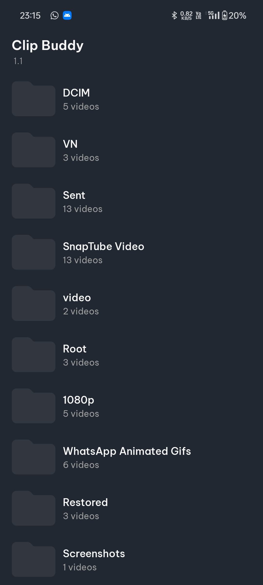
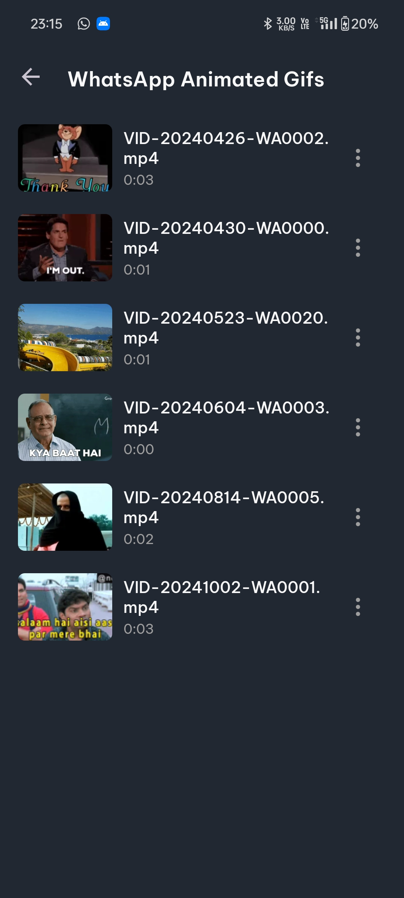
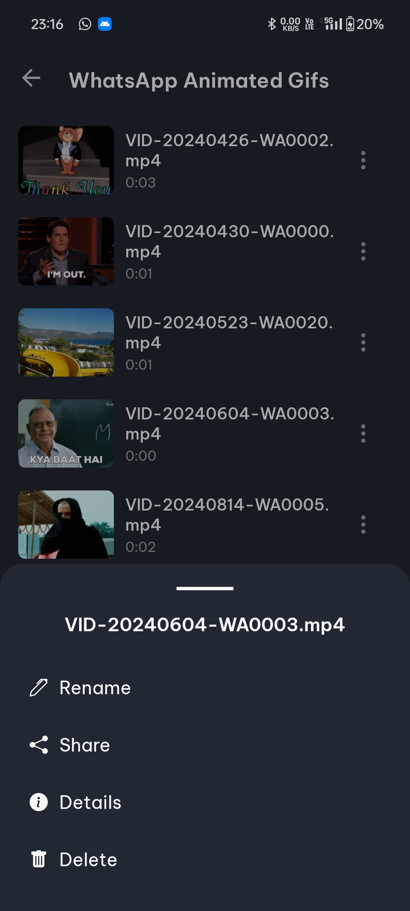
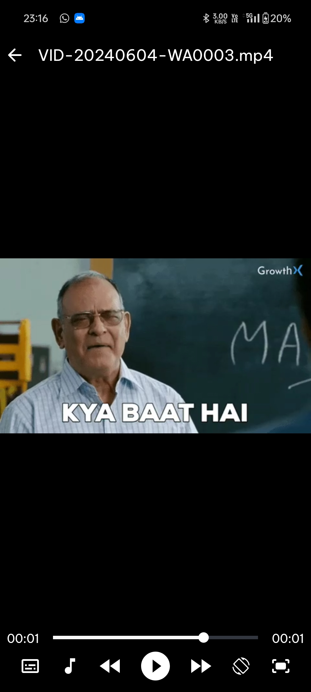

# Clip Buddy -  Video Player

**Clip Buddy** is a lightweight video player app built for Android using Kotlin and XML. Leveraging the power of the **Media3 ExoPlayer** library, it follows the MVVM architecture for a clean and efficient codebase. The app features a simple and intuitive user interface, making it easy for users to navigate and enjoy their video content seamlessly.

## Features

- **Folder Navigation**: Browse through folders to find and select your videos easily.
- **Video Playback**: Enjoy smooth playback of your video files with gesture controls.
    - **Volume Control**: Adjust the volume using simple swipe gestures.
    - **Brightness Control**: Control screen brightness with intuitive gestures.
- **Subtitles and Audio Tracks**: Change subtitle and audio tracks during playback for an enhanced viewing experience.
- **Video Management**: Options to rename, delete, or view details of your videos.

## Screenshots

## License

This project is licensed under the MIT License. See the LICENSE file for more details.
